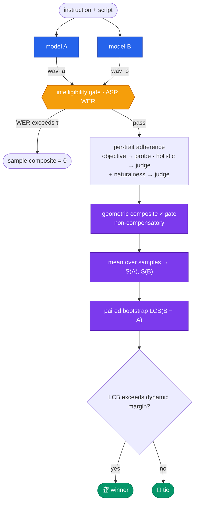

<div align="center">

# 🎙️ vocencebench

**A reproducible, gaming-resistant benchmark for prompt-controllable text-to-speech**

<p>
  <a href="https://pypi.org/project/vocencebench/"></a>
  
  
  
  
  
  
</p>

<p>
  <a href="#-why-this-exists"><b>Why</b></a> ·
  <a href="#-install"><b>Install</b></a> ·
  <a href="#-quickstart"><b>Quickstart</b></a> ·
  <a href="#-the-pipeline"><b>Pipeline</b></a> ·
  <a href="#-scoring-model"><b>Scoring</b></a> ·
  <a href="#-benchmark-corpus"><b>Corpus</b></a> ·
  <a href="#-documentation"><b>Docs</b></a>
</p>

</div>

---

## 🧭 Why this exists

Prompt-controllable text-to-speech (**PromptTTS**) synthesises speech from *two* inputs: a
**script** to read and a natural-language **voice instruction** —

> *"I need a voice for a 70-year-old Canadian man who is speaking in a quiet, low-pitched
> rumble. He should sound undeniably sad and speak quite slowly, yet maintain a remarkably
> warm tone despite his heartache."*

Evaluating such a system means answering two orthogonal questions at once:

| 🎯 Trait adherence | 🌊 Naturalness |
|---|---|
| *Did the model produce the voice that was requested?* Age, gender, emotion, accent, tone, pitch, loudness, pace — each an absolute "does the clip match" judgement where **both** systems under comparison can simultaneously be right. | *Is the delivery realistic, expressive, and intelligible* — especially on hard text (numbers, dates, URLs, nested clauses, tongue-twisters)? Inherently a **pairwise preference**: which of the two clips sounds better. |

…and then collapsing these heterogeneous sub-scores into **one defensible verdict**. Doing
that naïvely fails in well-known ways: a binary win/lose metric swamps graded ones in any
weighted sum; an arithmetic mean lets excellence in one trait *buy back* total failure in
another; and a point-estimate comparison crowns winners on pure noise.

`vocencebench` is engineered against all three failure modes.

> [!NOTE]
> **The contract:** same inputs → same verdict, bit-for-bit, on any machine. No single
> dimension can dominate or be traded away. A winner is declared only when its advantage is
> statistically real **and** perceptually audible — otherwise the result is an honest tie.

---

## ✨ Design principles

| # | Principle | What it means in practice |
|:-:|-----------|---------------------------|
| **1** | **Two numbers before one** | Adherence and naturalness are measured separately and fused only at the final decision. A model that nails the voice but reads flatly cannot hide — and neither can the reverse. |
| **2** | **Measure, don't guess** | Every objective trait is read from the waveform by a deterministic probe — identical across runs and machines, free per call, auditable. The audio-LLM judge is reserved for what genuinely needs an ear. |
| **3** | **Non-compensatory by construction** | Sub-scores combine through a *geometric* mean: any near-zero dimension collapses the whole sample. No weight to over-optimise, no dimension to trade away. |
| **4** | **No hidden humans, no hidden weights** | The headline ranking uses fixed equal weights and a fixed random seed. No human labelling, no per-run tuning — any evaluator recomputes the identical number. |
| **5** | **Winners are earned, not observed** | A challenger is crowned only when the *lower confidence bound* of a paired bootstrap on its advantage clears a margin grounded in human just-noticeable difference. |

---

## 📦 Install

```bash
pip install vocencebench                 # core — schema, aggregation, decision rule
pip install "vocencebench[probes]"       # + acoustic & classifier probes   (librosa, torch)
pip install "vocencebench[gemini]"       # + hosted audio-LLM judge backend
pip install "vocencebench[all]"          # everything, incl. CLI
```

---

## 🚀 Quickstart

End-to-end: synthesise → gate → probe → judge → aggregate → decide, in one call.

```python
import vocencebench as vb
from vocencebench.adapters import Qwen3TTSAdapter

# 1 · A judge that reasons over raw audio — hosted, or any OpenAI-compatible endpoint.
judge = vb.Judge.gemini(model="gemini-3.1-pro-preview")
# judge = vb.Judge.local(base_url="http://localhost:8003", model="Qwen/Qwen2.5-Omni-7B")

# 2 · Two PromptTTS systems, each a callable  (text, instruction) -> wav bytes.
model_a = Qwen3TTSAdapter("/path/to/checkpoint_a")
model_b = Qwen3TTSAdapter("/path/to/checkpoint_b")

# 3 · Benchmark on the frozen, hash-pinned corpus.
h2h = vb.benchmark(
    vb.load_benchmark("benchmark_v1"),        # 496 multi-trait items, sha256-pinned
    model_a, model_b, judge,
    probes=vb.with_classifiers(),             # acoustic + gender/emotion/accent/age
    transcriber=vb.whisper_transcriber(),     # enables the WER intelligibility gate
    labels=("model_a", "model_b"),
)

print(h2h.summary())                          # per-trait scores, naturalness, verdict
print(h2h.decision.winner)                    # "model_b"  — or "tie"
print(h2h.decision.reason)                    # the full audit trail of the decision
```

<details>
<summary><b>🔍 A single pairwise comparison</b> — when that is all you need</summary>

<br>

```python
verdict = judge.compare(
    text="The old lighthouse stood watch over the restless grey sea.",
    instruction="a calm elderly British man, speaking slowly and warmly",
    audio_a=open("a.wav", "rb").read(),
    audio_b=open("b.wav", "rb").read(),
    dimension="tone",                          # any registered trait, or "naturalness"
)
print(verdict.winner)          # "a" | "b" | "tie"
print(verdict.score_a)         # absolute 0–3 rubric score for clip A
print(verdict.reasoning_a)     # the judge's per-clip analysis — every verdict is auditable
```

</details>

<details>
<summary><b>💰 Judge economics</b> — why evaluation stays cheap</summary>

<br>

Seven of the eight traits are **objective** and scored by free, deterministic probes; only
holistic adherence (`tone`) and naturalness need the judge. The combined mode
(`all_at_once=True`) scores every judged dimension in **one** audio upload per duel, and
the hosted backend tracks exact token usage (`judge.backend.usage`) and spend
(`judge.backend.cost_usd()`) from the provider's own accounting — measured, not estimated.

</details>

---

## 🔬 The pipeline



---

## 🧮 Scoring model

The full derivation lives in **[docs/methodology.md](docs/methodology.md)**; this is the
five-step skeleton. All defaults are frozen constants — there are no free parameters at
ranking time.

### Step 1 · Desirability normalisation

Every sub-score is mapped to a common desirability scale `d ∈ [0, 1]` *before* any
combination, so no dimension enjoys a range advantage:

| Dimension | Raw measurement | → desirability `d` |
|-----------|-----------------|--------------------|
| ordinal probe — pace · pitch · loudness | bucket | `1.0` exact · `0.5` adjacent · `0.0` else |
| categorical probe — gender · emotion · accent | label | `1.0` match · `0.0` mismatch |
| numeric probe — age (tolerance τ = 8 yr) | years `m` vs requested `r` | `max(0, 1 − max(0, |m−r| − τ) / τ)` |
| judge — tone · naturalness | 0–3 rubric | `score / 3` |

### Step 2 · Non-compensatory per-sample composite

For one clip with desirabilities `d₁ … dₖ` and intelligibility gate `g ∈ {0, 1}`:

```text
                ⎛  Σⱼ wⱼ · ln max(dⱼ, ε)  ⎞
  S  =  g · exp ⎜  ─────────────────────  ⎟          wⱼ = 1   ·   ε = 0.01
                ⎝         Σⱼ wⱼ           ⎠
```

The geometric mean is a product in disguise: one near-zero dimension drags the whole sample
down, and nothing elsewhere buys it back. Eight perfect traits plus one at 0.05:

```text
  arithmetic mean :  (8 × 1.0 + 0.05) / 9   =  0.894    ← failure nearly invisible
  geometric  mean :  (1.0⁸ × 0.05)^(1/9)    =  0.717    ← failure clearly penalised
```

### Step 3 · Intelligibility gate

Each clip is transcribed (Whisper) and scored by word-error-rate against the script:

```text
  WER ≤ τ   →   g = 1        (default τ = 0.15)
  WER > τ   →   g = 0        →  sample composite S = 0
```

A hard veto, outside the mean, beyond rescue — pretty audio that says the wrong words is
worth nothing.

### Step 4 · Paired bootstrap lower confidence bound

Both systems read the *same* items, so per-sample paired differences
`δᵢ = S_B(i) − S_A(i)` cancel item-difficulty variance. The mean of `δ` is bootstrapped
(**N = 2000** resamples, **fixed seed 3151662**) and the **5th percentile** taken as a
one-sided 95% lower confidence bound:

```text
  LCB(B − A)  =  percentile₅ { mean(δ*) : 2000 seeded resamples δ* }
```

*"Even under a pessimistic reading of the evidence, does the challenger still lead?"*

### Step 5 · Dynamic decision margin

The LCB must clear a bar that rises as the incumbent approaches saturation:

```text
  margin(S_inc)  =  max( 0.015 ,  0.10 × (1 − S_inc) )

  winner  =  challenger    if  LCB > margin
          =  tie           otherwise
```

The floor **0.015** sits just below the human just-noticeable difference on comparison-MOS
scales (≈ 0.1 CMOS ≈ 0.017 on [0, 1]) — a "win" never rests on an inaudible gap.

### 🛡️ Why this resists gaming

| Attack | Defence |
|--------|---------|
| Over-optimise one loud dimension | desirability normalisation — all dimensions share `[0, 1]`; the geometric mean grants no leverage |
| Ignore a hard trait, compensate with an easy one | non-compensatory product — any near-zero collapses the sample |
| Emit beautiful audio that says the wrong words | WER gate zeroes the sample, outside the mean, beyond rescue |
| Win by a hair on a lucky draw | paired bootstrap LCB + JND-grounded margin demand a real, audible, repeatable lead |
| Quietly re-tune the aggregation | equal weights, fixed seed, closed-form margin — nothing to tune |

---

## 📊 What it measures

| Axis | Method | Per-clip output | Determinism |
|------|--------|:---------------:|:-----------:|
| **Adherence** — objective traits | DSP / classifier **probe** on the waveform | `d ∈ [0, 1]` | 🟢 exact |
| **Adherence** — holistic (`tone`) | order-swapped **audio-LLM judge**, 0–3 rubric | `d ∈ [0, 1]` | 🟡 version-pinned |
| **Naturalness** / quality | pairwise **audio-LLM judge**, per-category rubric | `d ∈ [0, 1]` | 🟡 version-pinned |
| **Intelligibility** | ASR (Whisper) **word-error-rate** | gate `{0, 1}` | 🟢 exact |

Every judged comparison can run in **both audio orders** — kept only when the orders agree
(`consistent=True`), which neutralises position bias, the dominant LLM-judge failure mode —
and the judge can be sampled `k` times and majority-voted (`votes=k`) to bound sampling
noise.

---

## 🎛️ Trait vocabulary

Eight controllable attributes · 39 reference levels · defined once in
**[`traits.py`](vocencebench/traits.py)** — probes, rubrics, corpus, and aggregation all
read this single registry, so adding a trait is a one-place change.

| Trait | Kind | Values |
|-------|------|--------|
| `gender` | objective | male · female |
| `age` | objective · numeric (± 8 yr) | 8 · 13 · 20 · 30 · 45 · 60 · 78 |
| `pace` | objective · ordinal | slow · moderate · fast |
| `pitch` | objective · ordinal | low · medium · high |
| `loudness` | objective · ordinal | quiet · normal · loud |
| `emotion` | objective | neutral · calm · happy · sad · angry · fearful · disgust · surprised |
| `accent` | objective | American · British · Australian · Indian · Canadian |
| `tone` | holistic | warm · authoritative · playful · serious · soothing · cheerful · sarcastic · formal |

---

## 🧊 Benchmark corpus

The shipped corpus — [`benchmark_v1.jsonl`](vocencebench/datasets/benchmark_v1.jsonl),
**496 items, SHA-256-pinned** — consists of *fully-specified* voices: every item fixes all
eight traits at once, both as structured fields and woven into one natural instruction, so
**every clip is scored on every trait**.

```jsonc
{
  "id": "vb-00001",
  "instruction": "Generate a voice for a playful twenty-year-old woman with an Indian accent
                  who is loudly expressing her surprise. Her voice should have a high pitch
                  and maintain a steady, moderate pacing.",
  "text": "Oh my gosh, you actually brought the puppy to the dorm room? I completely
           thought you were joking!",
  "traits": { "age": "20", "gender": "female", "emotion": "surprised", "pitch": "high",
              "loudness": "loud", "pace": "moderate", "accent": "Indian", "tone": "playful" },
  "difficulty": 1
}
```

**Three invariants** hold for every item:

1. All eight traits are present as structured fields.
2. The instruction and the fields never disagree.
3. The script *suits* the persona but never names a trait in words — the trait must be
   realised in **how** the clip is spoken, or it does not count.

**Difficulty tiers** stress intelligibility as well as control, at a fixed 0.35 / 0.40 / 0.25 mix:

| Tier | `difficulty` | Character |
|------|:------------:|-----------|
| easy | 0 | short, common everyday words |
| normal | 1 | a natural everyday sentence of moderate length |
| hard | 2 | tongue-twisters · dense numbers / dates / currency / URLs · nested clauses |

Trait values are assigned by a **seeded balanced-deck sampler**, so coverage is near-uniform
(~100 items per accent, ~62 per emotion and tone, ages 8 → 78) while combinations stay
uncorrelated. Because LLM wording is stochastic, **the frozen file — not the generator — is
the artifact**: the `.jsonl` and its `.sha256` are committed together and `corpus_hash()`
must reproduce the pin on load. A deterministic held-out split (`split_holdout`) keeps a
private partition so systems cannot be tuned against the public set.

Full details in **[docs/corpus.md](docs/corpus.md)**.

---

## ⚖️ The judge, briefly

- **Protocol** — the judge hears both clips interleaved with a rubric and must reason about
  each clip independently *before* comparing, returning strict JSON with per-clip 0–3
  scores, per-clip reasoning, winner, and confidence.
- **Reliability** — order-swap consistency, vote@k majority, bias rules in the prompt
  (ignore recording quality and base timbre; don't reward exaggeration), blinding to system
  identity, temperature 0.
- **Backends** — hosted (`Judge.gemini(...)`) or any local OpenAI-compatible audio endpoint
  (`Judge.local(base_url=..., model=...)`, e.g. Qwen2.5-Omni on vLLM). **One config change**
  swaps between them; same rubrics, same verdict schema.

Full treatment in **[docs/judge.md](docs/judge.md)**.

---

## 🔁 Reproducibility

> [!IMPORTANT]
> Given the same inputs, **every evaluator computes the identical ranking.** For a
> benchmark whose scores carry weight, this is a hard requirement — not a nice-to-have.

| Stage | Guarantee | Mechanism |
|-------|-----------|-----------|
| Corpus | identical items for all | frozen JSONL + SHA-256 pin |
| Probes | identical scores everywhere | pure functions of the waveform |
| Aggregation | identical composites | equal weights, closed-form geometric mean × gate |
| Bootstrap | identical confidence bound | fixed seed 3151662 · N = 2000 · α = 0.05 |
| Margin | identical threshold | closed form, no free parameters |
| Verdict | recomputable by third parties | pure function of published per-sample scores |

The judge is the one stochastic component; it is confined to a minority of dimensions, run
at temperature 0 with model + prompt versions logged, and its residual noise is absorbed by
the LCB. Details in **[docs/reproducibility.md](docs/reproducibility.md)**.

---

## 🗂️ Repository layout

```text
vocencebench/
├── traits.py          canonical trait registry — one place to add a trait
├── schema.py          Sample · Verdict · ProbeResult · report structures
├── corpus_llm.py      multi-trait corpus generator → freeze + hash-pin
├── corpus.py          deterministic template corpus (offline / CI)
├── probes/            deterministic probes — acoustic · classifier · age regression
├── judge/             audio-LLM judge — order-swap · vote@k · backends
├── prompts.py         judge rubrics + strict-JSON verdict schema
├── pair.py            one pair of clips → all traits + naturalness + gate
├── compare.py         symmetric head-to-head → Head2Head  (compare_models · benchmark)
├── decide.py          geometric composite → gate → paired LCB → margin → verdict
├── metrics.py         win-rate · control-success · confusion · bootstrap CI
├── transcribe.py      ASR transcriber for the intelligibility gate
├── adapters.py        any TTS model → (text, instruction) → wav bytes
├── calibration.py     optional judge-vs-human validation (diagnostic only)
├── cli.py             command-line interface
└── datasets/          benchmark_v1.jsonl + benchmark_v1.sha256
```

---

## 📚 Documentation

| Document | Contents |
|----------|----------|
| **[methodology.md](docs/methodology.md)** | The aggregation in full: desirability → geometric mean → gate → paired bootstrap LCB → dynamic margin. **Start here.** |
| [traits.md](docs/traits.md) | Trait registry — kinds, values, ordinal / numeric scoring |
| [corpus.md](docs/corpus.md) | Corpus generation, dataset schema, freezing, held-out splits |
| [probes.md](docs/probes.md) | Deterministic probes — acoustic formulas, classifiers, age regression |
| [judge.md](docs/judge.md) | The audio-LLM judge — protocol, reliability engineering, backends, cost |
| [adapters.md](docs/adapters.md) | Wrapping TTS models for evaluation |
| [cli.md](docs/cli.md) | Command-line reference |
| [reproducibility.md](docs/reproducibility.md) | Determinism guarantees and how to preserve them |
| [validation.md](docs/validation.md) | *Optional* judge validation against human labels (diagnostic only) |

---

## 📖 Citation

```bibtex
@software{vocencebench,
  title  = {vocencebench: A Reproducible, Gaming-Resistant Benchmark for
            Prompt-Controllable Text-to-Speech},
  author = {Vocence},
  year   = {2026},
  note   = {https://github.com/vocence-78/vocencebench}
}
```

---

## 📜 License

Released under the **MIT License** — see [LICENSE](LICENSE).

---

<div align="center">
<sub>Built for rigorous, adversarial-grade PromptTTS evaluation — where a benchmark must be
right even when someone is paid to prove it wrong.</sub>
</div>
